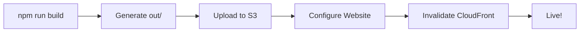

# Frontend Build & Deployment

Automated build scripts for deploying HiveMind Next.js frontend to AWS S3 + CloudFront.

## Prerequisites

- Node.js 18+
- AWS CLI configured
- S3 bucket for frontend hosting
- (Optional) CloudFront distribution

## Quick Start

### Windows

```powershell
.\build-frontend.ps1 `
  -S3Bucket hivemind-frontend-123456789 `
  -ApiUrl https://abc123.execute-api.ap-south-1.amazonaws.com/prod `
  -CloudFrontId E1234ABCD5678
```

### Linux/macOS

```bash
S3_FRONTEND_BUCKET=hivemind-frontend-123456789 \
NEXT_PUBLIC_API_URL=https://abc123.execute-api.ap-south-1.amazonaws.com/prod \
CLOUDFRONT_DISTRIBUTION_ID=E1234ABCD5678 \
./build-frontend.sh
```

## What It Does

1. **Creates .env.production** - Sets API URL for build
2. **Installs Dependencies** - Runs npm install
3. **Builds Next.js** - Generates static export in `out/`
4. **Uploads to S3** - Syncs files with optimized cache headers
5. **Configures Website** - Enables S3 static website hosting
6. **Invalidates CloudFront** - Clears CDN cache (optional)

## Configuration

### Required

- `S3_FRONTEND_BUCKET` - S3 bucket name for hosting
- `NEXT_PUBLIC_API_URL` - API Gateway endpoint URL

### Optional

- `CLOUDFRONT_DISTRIBUTION_ID` - CloudFront distribution ID
- `AWS_REGION` - AWS region (default: ap-south-1)

## Cache Strategy

**Static Assets** (JS, CSS, images):
```
Cache-Control: public, max-age=31536000, immutable
```

**HTML Files**:
```
Cache-Control: public, max-age=0, must-revalidate
```

## S3 Bucket Setup

### Create Bucket

```bash
aws s3 mb s3://hivemind-frontend-123456789 --region ap-south-1
```

### Enable Public Access

```bash
aws s3api put-public-access-block \
  --bucket hivemind-frontend-123456789 \
  --public-access-block-configuration \
    "BlockPublicAcls=false,IgnorePublicAcls=false,BlockPublicPolicy=false,RestrictPublicBuckets=false"
```

### Set Bucket Policy

```json
{
  "Version": "2012-10-17",
  "Statement": [
    {
      "Sid": "PublicReadGetObject",
      "Effect": "Allow",
      "Principal": "*",
      "Action": "s3:GetObject",
      "Resource": "arn:aws:s3:::hivemind-frontend-123456789/*"
    }
  ]
}
```

```bash
aws s3api put-bucket-policy \
  --bucket hivemind-frontend-123456789 \
  --policy file://bucket-policy.json
```

## CloudFront Setup

### Create Distribution

```bash
aws cloudfront create-distribution \
  --origin-domain-name hivemind-frontend-123456789.s3-website.ap-south-1.amazonaws.com \
  --default-root-object index.html
```

### Custom Error Pages (SPA Routing)

Configure CloudFront to return `index.html` for 404 errors:

1. Go to CloudFront Console
2. Select distribution
3. Error Pages tab
4. Create Custom Error Response:
   - HTTP Error Code: 404
   - Customize Error Response: Yes
   - Response Page Path: /index.html
   - HTTP Response Code: 200

## Output Structure

```
out/
├── index.html
├── 404.html
├── _next/
│   ├── static/
│   │   ├── chunks/
│   │   └── css/
│   └── ...
└── ...
```

## Deployment Workflow



## Environment Variables

### Development (.env.local)

```bash
NEXT_PUBLIC_API_URL=http://localhost:8000
```

### Production (.env.production)

```bash
NEXT_PUBLIC_API_URL=https://abc123.execute-api.ap-south-1.amazonaws.com/prod
```

## Troubleshooting

### Build Fails with TypeScript Errors

Fixed in `next.config.js`:
```js
typescript: {
  ignoreBuildErrors: true,
}
```

### 404 on Page Refresh

Configure CloudFront custom error response (see above).

### API Calls Fail (CORS)

Ensure Lambda functions return CORS headers:
```python
'Access-Control-Allow-Origin': '*'
```

### Old Content Cached

Invalidate CloudFront:
```bash
aws cloudfront create-invalidation \
  --distribution-id E1234ABCD5678 \
  --paths "/*"
```

## CI/CD Integration

### GitHub Actions

```yaml
- name: Deploy Frontend
  run: |
    ./build-frontend.sh
  env:
    S3_FRONTEND_BUCKET: ${{ secrets.S3_BUCKET }}
    NEXT_PUBLIC_API_URL: ${{ secrets.API_URL }}
    CLOUDFRONT_DISTRIBUTION_ID: ${{ secrets.CF_ID }}
```

### AWS CodeBuild

```yaml
phases:
  build:
    commands:
      - chmod +x build-frontend.sh
      - ./build-frontend.sh
```

## Manual Deployment

```bash
# Build locally
npm run build

# Upload manually
aws s3 sync out/ s3://your-bucket/ --delete

# Invalidate CloudFront
aws cloudfront create-invalidation \
  --distribution-id YOUR_ID \
  --paths "/*"
```

## Cost Optimization

- **S3**: ~$0.023/GB storage + $0.09/GB transfer
- **CloudFront**: First 1TB free, then $0.085/GB
- **Estimated**: $5-20/month for typical traffic

## Security

- Enable HTTPS only via CloudFront
- Use CloudFront Origin Access Identity (OAI)
- Set restrictive bucket policies
- Enable CloudFront WAF for DDoS protection

## Performance

- Static export = instant page loads
- CloudFront CDN = global edge caching
- Immutable assets = aggressive caching
- Typical TTFB: <100ms globally
